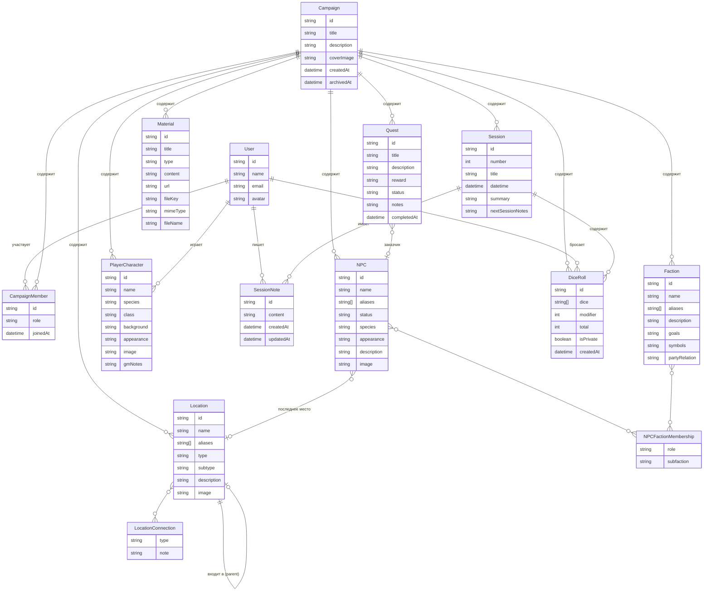

# TTRPG Companion — Entity Relationship Diagram

> Откройте в Obsidian в режиме Preview для отображения диаграммы.
> v0.3 — 20.03.2026

```mermaid
erDiagram
    User {
        string id
        string name
        string email
        string avatar
    }

    Campaign {
        string id
        string title
        string description
        string coverImage
        datetime createdAt
        datetime archivedAt
    }

    CampaignMember {
        string id
        string role
        datetime joinedAt
    }

    NPC {
        string id
        string name
        string[] aliases
        string status
        string species
        string appearance
        string description
        string image
    }

    PlayerCharacter {
        string id
        string name
        string species
        string class
        string background
        string appearance
        string image
        string gmNotes
    }

    Session {
        string id
        int number
        string title
        datetime datetime
        string summary
        string nextSessionNotes
    }

    SessionNote {
        string id
        string content
        datetime createdAt
        datetime updatedAt
    }

    Location {
        string id
        string name
        string[] aliases
        string type
        string subtype
        string description
        string image
    }

    LocationConnection {
        string type
        string note
    }

    Faction {
        string id
        string name
        string[] aliases
        string description
        string goals
        string symbols
        string partyRelation
    }

    Quest {
        string id
        string title
        string description
        string reward
        string status
        string notes
        datetime completedAt
    }

    Material {
        string id
        string title
        string type
        string content
        string url
        string fileKey
        string mimeType
        string fileName
    }

    DiceRoll {
        string id
        string[] dice
        int modifier
        int total
        boolean isPrivate
        datetime createdAt
    }

    NPCFactionMembership {
        string role
        string subfaction
    }

    User ||--o{ CampaignMember : "участвует"
    Campaign ||--o{ CampaignMember : "содержит"

    Campaign ||--o{ NPC : "содержит"
    Campaign ||--o{ PlayerCharacter : "содержит"
    Campaign ||--o{ Session : "содержит"
    Campaign ||--o{ Location : "содержит"
    Campaign ||--o{ Faction : "содержит"
    Campaign ||--o{ Quest : "содержит"
    Campaign ||--o{ Material : "содержит"

    User ||--o{ PlayerCharacter : "играет"
    User ||--o{ SessionNote : "пишет"

    Session ||--o{ SessionNote : "имеет"

    NPC }o--o{ NPCFactionMembership : ""
    Faction }o--o{ NPCFactionMembership : ""

    Location ||--o| Location : "входит в (parent)"
    Location }o--o{ LocationConnection : ""

    Campaign ||--o{ DiceRoll : "содержит"
    User ||--o{ DiceRoll : "бросает"
    Session ||--o{ DiceRoll : "содержит"

    NPC }o--o| Location : "последнее место"
    Quest }o--o| NPC : "заказчик"
```
