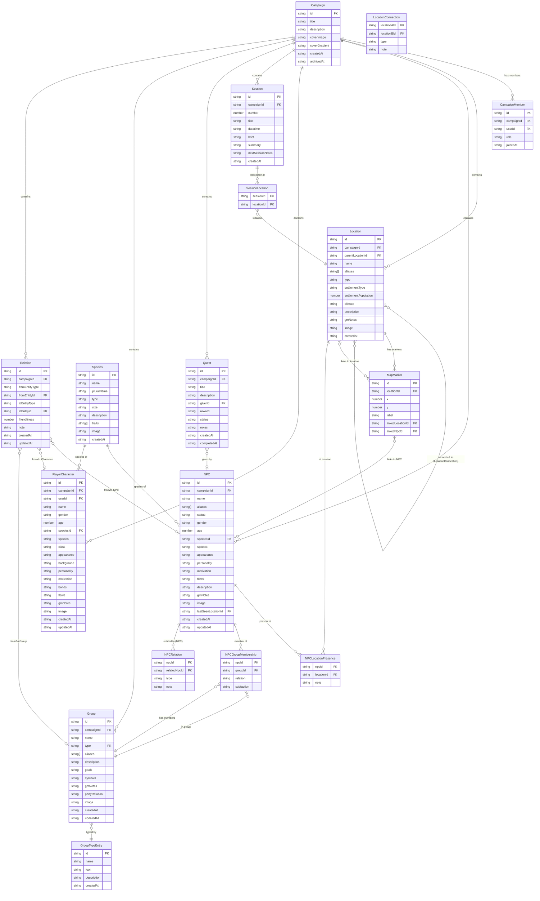

# Arcane Ledger — Entity Relationship Diagram

Mermaid ERD. Render in any Markdown viewer that supports Mermaid (GitHub, Notion, VS Code with extension).

---

---

## Notes

- **Relation** is polymorphic — `fromEntityType` / `toEntityType` can be `npc`, `character`, or `group`. In a relational DB this would be implemented as a polymorphic FK or a union of nullable FKs.
- **NPCGroupMembership** and **NPCLocationPresence** are currently embedded arrays on the NPC document (not separate tables in the localStorage mock). The ERD shows them as logical join tables for clarity.
- **SessionLocation** is `Session.locationIds: string[]` embedded on the Session — shown as a join table for ERD readability.
- **Species** is **not** campaign-scoped — it's a global catalogue shared across all campaigns.
- **GroupTypeEntry** is also global (not per-campaign).
- **MapMarker** is embedded in `Location.mapMarkers[]` in the current implementation.
